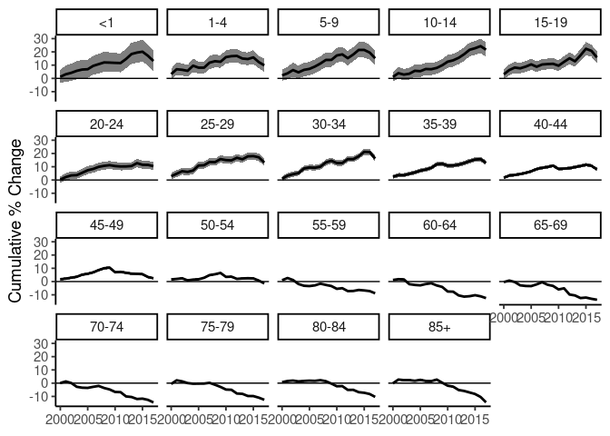

<!-- README.md is generated from README.Rmd. Please edit that file -->

Surveil
=======

Public Health Surveillance
--------------------------


The **surveil** R package provides time series models for routine public
health surveillance tasks: model time trends in mortality or disease
incidence rates to make inferences about health inequalities, cumulative
and period percent change, and age-standardized rates.

**surveil** is an interface to [Stan](https://mc-stan.org), a
state-of-the-art platform for Bayesian inference.

### Installation

This project is still under development.

### Usage

Model time series data of mortality or disease incidence by loading the
**surveil** package into R together with disease surveillance data.
Tables exported from CDC WONDER are automatically in the correct format.

``` r
library(surveil)
library(knitr)
data(cancer)

kable(head(cancer), 
      booktabs = TRUE,
      caption = "Table 1. A glimpse of cancer surveillance data")
```

|  Year| Age   |  Count|  Population|
|-----:|:------|------:|-----------:|
|  1999| &lt;1 |    866|     3708753|
|  1999| 1-4   |   2959|    14991152|
|  1999| 5-9   |   2226|    20146188|
|  1999| 10-14 |   2447|    19742631|
|  1999| 15-19 |   3875|    19585857|
|  1999| 20-24 |   5969|    18148795|

Model trends in risk and easily obtain functions of risk estimates, such
as cumulative percent change:

``` r
fit <- stan_rw(data = cancer,
               time = Year,
               group = Age,
           refresh = 0 ## silence some printing
           )
```

    ## [1] "Setting normal prior(s) for eta_1: "
    ##  location scale
    ##        -5    10
    ## [1] "\nSetting half-normal prior for sigma: "
    ##  location scale
    ##         0     1

``` r
fit_apc <- apc(fit)
plot(fit_apc, cumulative = TRUE)
```



### Citation

> Donegan, Connor (2021). surveil: Public health surveillance. R package
> version 0.1.0.,
> <a href="https://connordonegan.github.io/surveil/" class="uri">https://connordonegan.github.io/surveil/</a>

    bibentry(
      bibtype = "Manual",
      title= "surveil: Public Health Surveillance",
      author= "Donegan, Connor",
      url = "https://connordonegan.github.io/surveil/",
      year = 2021,
      note = "R package version 0.1.0"
    )

All **surveil** models were built using Stan:

> Stan Development Team. 2021. Stan Modeling Language Users Guide and
> Reference Manual, 2.28.
> <a href="https://mc-stan.org" class="uri">https://mc-stan.org</a>

    bibentry(
      bibtype = "Manual",
      title= "Stan Modeling Language Users Guide and Reference Manual",
      author= "{Stan Development Team}",
      url = "https://mc-stan.org",
      year = 2021,
      note = "Version 2.28"
    )
