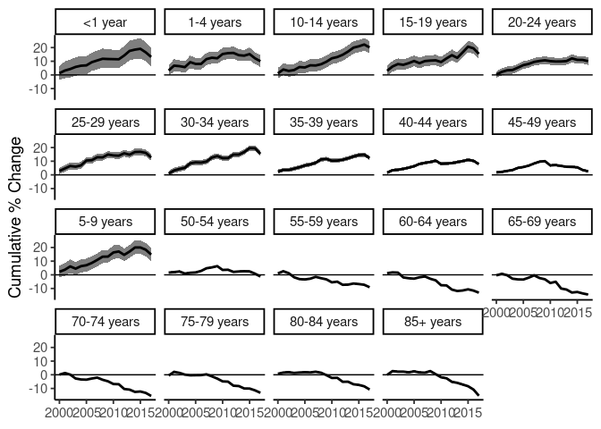

<!-- README.md is generated from README.Rmd. Please edit that file -->

# Surveil

### Models for routine public health surveillance

#### Measure and monitor health inequalities

#### Cumulative and period percent change

#### Age standardization methods

#### Fully Bayesian inference

### Installation

From **R** (\>= version 4.05), install **surveil** using:

``` r
if (!require(drat)) install.packages("drat")
drat::addRepo("connordonegan")
install.packages("surveil")
```

### Usage

Model time series data of moratlity or disease incidence by loading the
**surveil** package into R together with disease surveillance data.
Tables exported from CDC WONDER are automatically in the correct format.

``` r
library(surveil)
library(knitr)
data(cancer)

kable(head(cancer), 
      booktabs = TRUE,
      caption = "A glimpse of cancer surveillance data")
```

| Year | Age         | Label | Count | Population |
|-----:|:------------|:------|------:|-----------:|
| 1999 | \<1 year    | \<1   |   866 |    3708753 |
| 1999 | 1-4 years   | 1-4   |  2959 |   14991152 |
| 1999 | 5-9 years   | 5-9   |  2226 |   20146188 |
| 1999 | 10-14 years | 10-14 |  2447 |   19742631 |
| 1999 | 15-19 years | 15-19 |  3875 |   19585857 |
| 1999 | 20-24 years | 20-24 |  5969 |   18148795 |

A glimpse of cancer surveillance data

``` r
fit <- stan_rw(data = cancer,
               time = Year,
               group = Age)
```

    ## [1] "Setting Student t prior(s) for eta_1: "

    ## Distribution: student_t

    ##   df location scale
    ## 1 20       -5    10
    ## [1] "\nSetting half-Student t prior for sigma: "

    ## Distribution: student_t

    ##   df location scale
    ## 1 20        0     1
    ## 
    ## SAMPLING FOR MODEL 'poissonRW' NOW (CHAIN 1).
    ## Chain 1: 
    ## Chain 1: Gradient evaluation took 5.2e-05 seconds
    ## Chain 1: 1000 transitions using 10 leapfrog steps per transition would take 0.52 seconds.
    ## Chain 1: Adjust your expectations accordingly!
    ## Chain 1: 
    ## Chain 1: 
    ## Chain 1: Iteration:    1 / 3000 [  0%]  (Warmup)
    ## Chain 1: Iteration: 1500 / 3000 [ 50%]  (Warmup)
    ## Chain 1: Iteration: 1501 / 3000 [ 50%]  (Sampling)
    ## Chain 1: Iteration: 3000 / 3000 [100%]  (Sampling)
    ## Chain 1: 
    ## Chain 1:  Elapsed Time: 5.59002 seconds (Warm-up)
    ## Chain 1:                2.37184 seconds (Sampling)
    ## Chain 1:                7.96186 seconds (Total)
    ## Chain 1: 
    ## 
    ## SAMPLING FOR MODEL 'poissonRW' NOW (CHAIN 2).
    ## Chain 2: 
    ## Chain 2: Gradient evaluation took 5e-05 seconds
    ## Chain 2: 1000 transitions using 10 leapfrog steps per transition would take 0.5 seconds.
    ## Chain 2: Adjust your expectations accordingly!
    ## Chain 2: 
    ## Chain 2: 
    ## Chain 2: Iteration:    1 / 3000 [  0%]  (Warmup)
    ## Chain 2: Iteration: 1500 / 3000 [ 50%]  (Warmup)
    ## Chain 2: Iteration: 1501 / 3000 [ 50%]  (Sampling)
    ## Chain 2: Iteration: 3000 / 3000 [100%]  (Sampling)
    ## Chain 2: 
    ## Chain 2:  Elapsed Time: 6.27161 seconds (Warm-up)
    ## Chain 2:                3.0579 seconds (Sampling)
    ## Chain 2:                9.32951 seconds (Total)
    ## Chain 2: 
    ## 
    ## SAMPLING FOR MODEL 'poissonRW' NOW (CHAIN 3).
    ## Chain 3: 
    ## Chain 3: Gradient evaluation took 0.000169 seconds
    ## Chain 3: 1000 transitions using 10 leapfrog steps per transition would take 1.69 seconds.
    ## Chain 3: Adjust your expectations accordingly!
    ## Chain 3: 
    ## Chain 3: 
    ## Chain 3: Iteration:    1 / 3000 [  0%]  (Warmup)
    ## Chain 3: Iteration: 1500 / 3000 [ 50%]  (Warmup)
    ## Chain 3: Iteration: 1501 / 3000 [ 50%]  (Sampling)
    ## Chain 3: Iteration: 3000 / 3000 [100%]  (Sampling)
    ## Chain 3: 
    ## Chain 3:  Elapsed Time: 7.9722 seconds (Warm-up)
    ## Chain 3:                3.46218 seconds (Sampling)
    ## Chain 3:                11.4344 seconds (Total)
    ## Chain 3: 
    ## 
    ## SAMPLING FOR MODEL 'poissonRW' NOW (CHAIN 4).
    ## Chain 4: 
    ## Chain 4: Gradient evaluation took 9.4e-05 seconds
    ## Chain 4: 1000 transitions using 10 leapfrog steps per transition would take 0.94 seconds.
    ## Chain 4: Adjust your expectations accordingly!
    ## Chain 4: 
    ## Chain 4: 
    ## Chain 4: Iteration:    1 / 3000 [  0%]  (Warmup)
    ## Chain 4: Iteration: 1500 / 3000 [ 50%]  (Warmup)
    ## Chain 4: Iteration: 1501 / 3000 [ 50%]  (Sampling)
    ## Chain 4: Iteration: 3000 / 3000 [100%]  (Sampling)
    ## Chain 4: 
    ## Chain 4:  Elapsed Time: 8.36117 seconds (Warm-up)
    ## Chain 4:                3.05784 seconds (Sampling)
    ## Chain 4:                11.419 seconds (Total)
    ## Chain 4:

``` r
fit_apc <- apc(fit)
plot(fit_apc, cumulative = TRUE)
```


