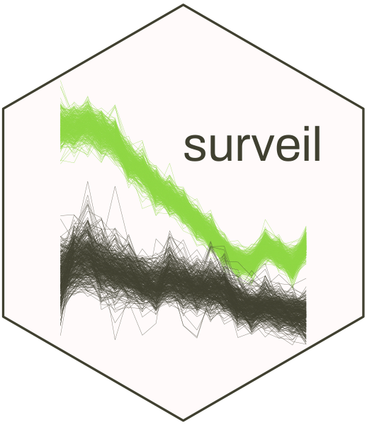

---
output:
  md_document:
    variant: markdown_github
---

<!-- README.md is generated from README.Rmd. Please edit that file -->

# Surveil 



### Public health surveillance 

#### Measure and monitor health inequalities

#### Cumulative and period percent change

#### Age standardization methods

#### Fully Bayesian inference

### Installation

From **R** (>= version 4.05), install **surveil** using:

``` r
if (!require(drat)) install.packages("drat")
drat::addRepo("connordonegan")
install.packages("surveil")
```

### Usage

Model time series data of moratlity or disease incidence by loading the **surveil** package into R together with disease surveillance data. Tables exported from CDC WONDER are automatically in the correct format.

```{r}
library(surveil)
library(knitr)
data(cancer)

kable(head(cancer), 
      booktabs = TRUE,
      caption = "Table 1. A glimpse of cancer surveillance data")
```


Model trends in risk with the `stan_rw` function, and easily view functions of risk estimates, such as cumulative percent change:

```{r eval = FALSE}
fit <- stan_rw(data = cancer,
               time = Year,
               group = Age)

fit_apc <- apc(fit)
plot(fit_apc, cumulative = TRUE)
```


### Citation

When using **surveil** in publications, please cite the package:

> Donegan, Connor (2021). surveil: Public health surveillance. R package version 0.1.0., https://connordonegan.github.io/surveil/

```
bibentry(
  bibtype = "Manual",
  title= "surveil: Public Health Surveillance",
  author= "Donegan, Connor",
  url = "https://connordonegan.github.io/surveil/",
  year = 2021,
  note = "R package version 0.1.0"
)
)
```

All **surveil** models were built using Stan, so please cite Stan as well:

> Stan Development Team. 2021. Stan Modeling Language Users Guide and Reference Manual, 2.28. https://mc-stan.org
```
bibentry(
  bibtype = "Manual",
  title= "Stan Modeling Language Users Guide and Reference Manual",
  author= "{Stan Development Team}",
  url = "https://mc-stan.org",
  year = 2021,
  note = "Version 2.28"
)
```

