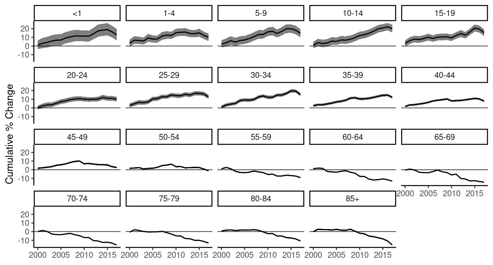

<!-- README.md is generated from README.Rmd. Please edit that file -->

surveil: Public health surveillance
-----------------------------------


The **surveil** R package provides time series models for routine public
health surveillance tasks: model time trends in mortality or disease
incidence rates to make inferences about levels of risk, cumulative and
period percent change, age-standardized rates, and health inequalities.

**surveil** is an interface to [Stan](https://mc-stan.org), a
state-of-the-art platform for Bayesian inference. For analysis of
spatial health data see the
[**geostan**](https://connordonegan.github.io/geostan/) R package.

### Installation

**surveil** is available on CRAN; install from R using:

``` r
install.packages("surveil")
```

### Vignettes

Review the package vignettes to get started:

-   `vignette("surveil-demo")`: An introduction to health modeling with
    **surveil**
-   `vignette("age-standardization")`: How to age-standardize
    **surveil** model results and compare age-stratified populations
-   `vignette("surveil-mcmc")`: A brief introduction to Markov chain
    Monte Carlo (MCMC) with **surveil**

Also see the online
[documentation](https://connordonegan.github.io/surveil/reference/index.html).

### Usage

Model time series data of mortality or disease incidence by loading the
**surveil** package into R together with disease surveillance data.
Tables exported from CDC WONDER are automatically in the correct format.

``` r
library(surveil)
library(knitr)
data(cancer)

kable(head(cancer), 
      booktabs = TRUE,
      caption = "Table 1. A glimpse of cancer surveillance data")
```

|  Year| Age   |  Count|  Population|
|-----:|:------|------:|-----------:|
|  1999| &lt;1 |    866|     3708753|
|  1999| 1-4   |   2959|    14991152|
|  1999| 5-9   |   2226|    20146188|
|  1999| 10-14 |   2447|    19742631|
|  1999| 15-19 |   3875|    19585857|
|  1999| 20-24 |   5969|    18148795|

Model trends in risk and easily view functions of risk estimates, such
as cumulative percent change:

``` r
fit <- stan_rw(data = cancer,
               time = Year, 
               group = Age)

fit_apc <- apc(fit)
plot(fit_apc, cumulative = TRUE)
```


*Cumulative percent change in US cancer incidence by age group*
